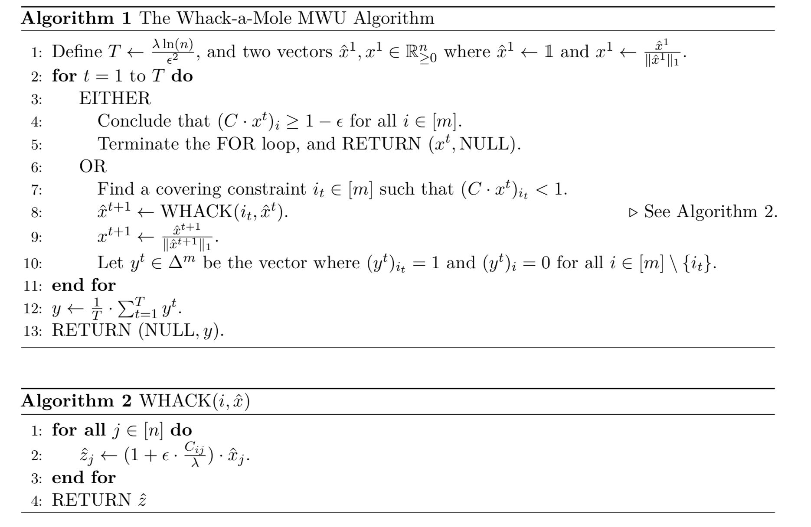

**3 Visualizations of the Section 4.1 Static Algorithm [Click Videos]**

**Primary Video**:  Lambda = 2, Epsilon = 0.1 

**Psuedocode** for Algorithm

**Video 2**:  Lambda = 2, Epsilon = 0.1. Return x terminating condition 

**Video 3**: Lambda = 1, Epsilon = 0.3. Return y terminating condition
